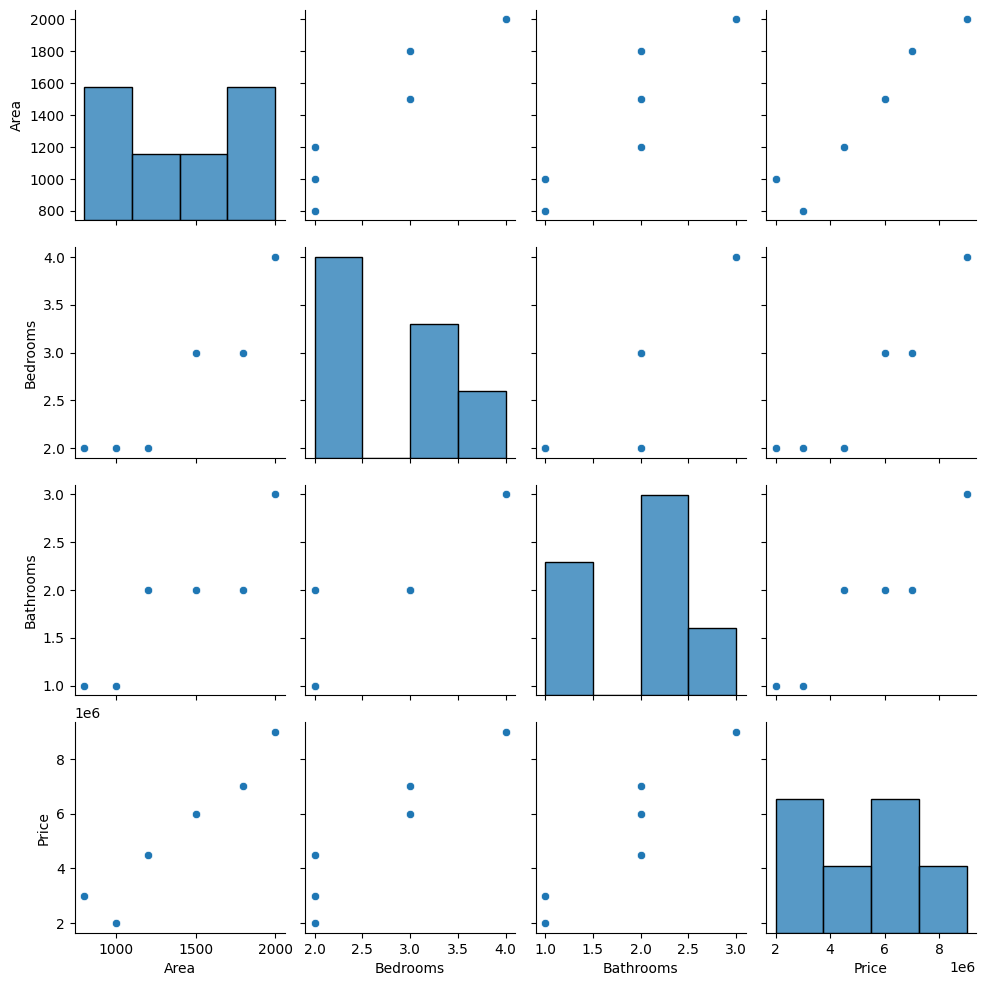
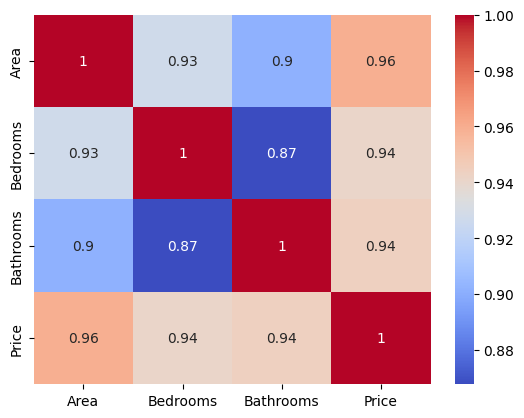
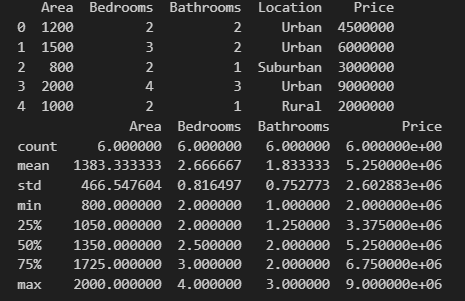

# 🏠 House Price Prediction System (Machine Learning)

This project is a complete end-to-end Machine Learning application that predicts house prices based on various features such as area, number of bedrooms, bathrooms, and location. The model is built using **Linear Regression** and includes data preprocessing, feature engineering, exploratory data analysis (EDA), model training, and evaluation.

---

## 📌 Project Overview

The goal of this project is to:
- Clean and preprocess housing data  
- Analyze data using visualization techniques  
- Train a machine learning model to predict house prices  
- Evaluate the model using standard metrics  

This project is suitable for **AIML freshers** and is designed in a clean, modular, and professional way.

---

## 🛠️ Technologies Used

- **Python**
- **Pandas**
- **NumPy**
- **Scikit-learn**
- **Matplotlib**
- **Seaborn**
- **Jupyter Notebook**

---

## 📁 Project Structure
```
House_Price_Prediction/
│
├── data/
│   └── housing.csv
│
├── notebooks/
│   └── house_price_analysis.ipynb
│
├── src/
│   ├── data_preprocessing.py
│   ├── model_training.py
│   ├── evaluation.py
│
├── app.py
├── requirements.txt
└── README.md

```
---
## ⚙️ How to Run the Project

### Step 1: Clone the Repository
```bash
git clone https://github.com/yourusername/House_Price_Prediction.git
cd House_Price_Prediction
```

### Step 2: Install Dependencies
```
pip install -r requirements.txt
```
### Step 3: Run the Project
```
python app.py

```
## 📊 Exploratory Data Analysis (EDA)
The project includes data visualization using Matplotlib and Seaborn to understand relationships between features and house prices.
```
cd notebooks
jupyter notebook house_price_analysis.ipynb
```
## 📈 Model Evaluation
The model performance is evaluated using:
- **R² Score**
- **Mean Squared Error (MSE)**
  
These metrics help in understanding how well the model fits the data.

##🖼️ Screenshots






